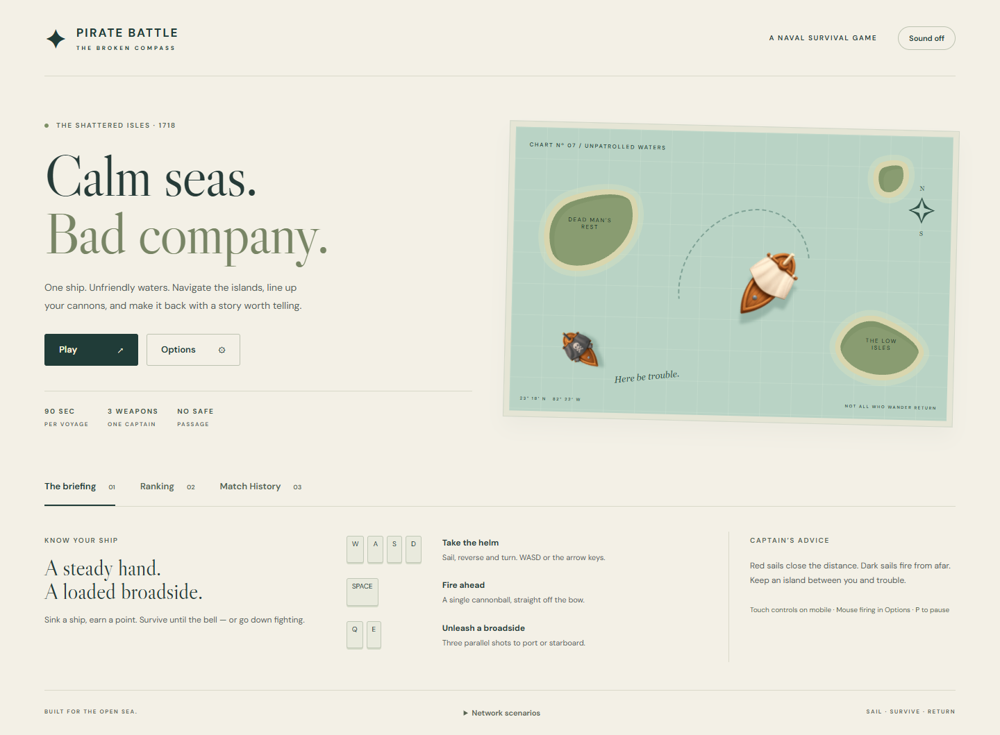
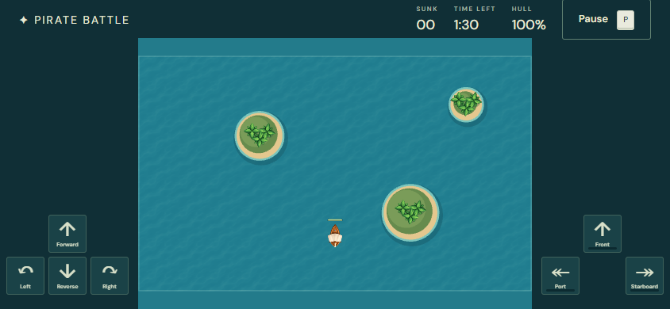

# Pirate Battle — The Broken Compass

A single-player naval survival game built for the Jungle Gaming frontend challenge. Sail around the islands, sink enemy ships, and survive until the timer runs out. A destroyed enemy is worth one point; a Chaser that rams the player is not.

[Play the game](https://luizfelippe-dev.github.io/pirate-battle/) · [Verification workflow](https://github.com/luizfelippe-dev/pirate-battle/actions/workflows/verify.yml)



## Run locally

Use Node.js 22.12+ or 24 and pnpm 11.25.0.

```sh
corepack enable
pnpm install --frozen-lockfile
pnpm dev
```

Open `http://127.0.0.1:5173`. No account, API key, database, or private service is needed. MSW starts before React and intercepts the ranking and history requests in development **and** production. Fonts, images, and sound effects are served locally.

## Commands

| Command                                 | Purpose                                                              |
| --------------------------------------- | -------------------------------------------------------------------- |
| `pnpm dev`                              | Development server                                                   |
| `pnpm build`                            | Strict TypeScript check and production build                         |
| `pnpm preview`                          | Serve the production build                                           |
| `pnpm typecheck`                        | TypeScript without emitting files                                    |
| `pnpm lint`                             | ESLint                                                               |
| `pnpm format:check`                     | Formatting check                                                     |
| `pnpm test`                             | Simulation tests                                                     |
| `pnpm exec playwright install chromium` | Install the E2E browser                                              |
| `pnpm test:e2e`                         | Chromium desktop and mobile flows, including visual comparisons      |
| `pnpm test:visual`                      | Regenerate visual baselines; inspect changes before committing       |
| `pnpm report`                           | Open the latest Playwright HTML report                               |
| `pnpm run profile`                      | Optimized profiling build, real-time voyage, and five cleanup cycles |

The Playwright server enables `VITE_TEST_MODE=true`: tests control the clock but still run the real input handlers, simulation, collisions, and Pixi renderer. Never set this variable on the public deployment. The normal build has no test clock. `VITE_PROFILE_MODE=true` adds a read-only measurement interface while retaining the normal ticker; `.env.profile` enables it only for profiling builds. Run `pnpm build` again after profiling to restore the normal production output.

## Controls

| Action              | Keyboard            |
| ------------------- | ------------------- |
| Sail forward        | W / Up              |
| Sail backward       | S / Down            |
| Rotate              | A / Left, D / Right |
| Front cannon        | Space               |
| Port broadside      | Q                   |
| Starboard broadside | E                   |
| Pause               | P / Escape          |

Touch buttons support simultaneous movement and attacks. Both mobile orientations are supported; landscape gives the arena more usable space. The world always measures 1200 × 720 logical units and fits entirely on screen. Backgrounding the page or losing focus pauses the game. Resuming requires an explicit action and clears held inputs.

Enable **Mouse firing** in Options to hold the left button for the front cannon and the right button for both broadsides. Click inside the arena; cannons follow the ship's heading. Keyboard weapons remain available, and releasing one device does not cancel another held input. The preference survives refresh. Cancel discards unsaved settings.

Reverse moves at 110 units/s, compared with 195 units/s forward. It uses the same collision rules; pressing forward and reverse together stops thrust. This addition uses balance version 2, so its ranking excludes older version-1 matches. Older matches remain in history.

On touch screens, the helm and weapon pads sit under separate thumbs. Landscape moves them beside the arena. Gold bars indicate weapon readiness. Water and wake animation use active game time; a reduced-motion system preference disables them when the next match starts.



The sound toggle is off initially and persists locally. Red sails identify Chasers, which explode on contact. Dark sails identify Shooters, which fire within range. Islands stop ships and cannonballs. Damaged sails and hull bars show remaining health.

## Options and balance

Options accepts a whole-number session duration from 60 to 180 seconds and an enemy spawn interval from 1 to 10 seconds. Defaults are 90 and 4 seconds. Smaller spawn intervals increase pressure; each run keeps its starting settings. Ranking only compares matches with identical options and balance version.

`src/game/config.ts` holds movement, turning, health, projectile damage, velocity, lifetime, cooldowns, Shooter range, spawn distance and type distribution. Increment the balance version when changing those rules. The default repeating spawn pattern is Chaser, Shooter, Chaser. There is no difficulty escalation hidden in the simulation.

Reloading or abandoning a battle discards that unfinished run. Options, sound preference, player identity, the last completed result, confirmed records, and the pending queue are stored under the `pirate:` localStorage prefix. A result enters the pending queue **before** the network request. A failed upload never prevents another game.

## Network scenarios

Open **Network scenarios** in the footer. The selector persists across reloads. **Reset mock records** clears confirmations and restores the successful connection; it deliberately preserves pending results so they can be recovered.

| Scenario                      | Behavior                                                              |
| ----------------------------- | --------------------------------------------------------------------- |
| success                       | 120 ms latency and 23 fixture opponents across five pages             |
| empty                         | Empty ranking and history reads                                       |
| populated                     | Adds 12 current-player fixture voyages for history pagination         |
| slow                          | 1800 ms latency                                                       |
| variable                      | Alternating 1600 / 90 ms latency, allowing out-of-order responses     |
| timeout                       | Response exceeds the 3500 ms HTTP timeout                             |
| offline                       | Simulated network failure                                             |
| bad-request                   | HTTP 400                                                              |
| server-error                  | HTTP 503                                                              |
| ranking-error / history-error | Failure isolated to the selected resource                             |
| timeout-after-save            | Server persists a new match, then delays its reply beyond the timeout |
| asset-error-once              | First Chaser texture request fails; Retry loading requests it again   |

To check recovery, select **offline**, complete a game, and reload. Switch to **success** and select **Retry registration**. Both panels should include the same recovered match. To check idempotency, finish a game using **timeout-after-save**. The automatic retry returns the existing record instead of inserting another one.

Ranking sorts by score descending, then completion date ascending, then match ID. History shows the current device's player, newest first. Fixtures only belong to the default 90s / 4s configuration; changing options may produce an empty ranking. This is intentional, since scores from different rules should not compete.

## Deployment

The app is a static Vite build. Import the repository into Vercel, set the build command to `pnpm build`, and use `dist` as the output directory. No environment variables are required. `vercel.json` includes the worker cache policy. Netlify configuration is also included.

GitHub Pages is supported through `.github/workflows/deploy.yml`. Enable Pages with GitHub Actions as the source. The workflow sets `BASE_PATH=/pirate-battle/`; change that value if the repository is renamed. Root-domain deployments leave `BASE_PATH` unset. Asset URLs, API paths and service-worker scope follow Vite's base path.

Use HTTPS; service workers require it outside localhost. `mockServiceWorker.js` must be available beneath the configured base path. Do not proxy simulated API routes to another service. After deployment, check a fresh load, refresh, a completed game, ranking, history and timeout recovery. Records belong to that browser and origin, not a shared backend.

## Notes

- [Architecture](ARCHITECTURE.md): responsibilities, lifecycle, persistence and API contracts.
- [Verification](docs/VERIFICATION.md): test coverage, reproduction and evidence.
- [Performance](docs/PERFORMANCE.md): measured environment and limitations.
- [Third-party notices](THIRD_PARTY_NOTICES.md): supplied assets and font licenses.
- [Original challenge](docs/CHALLENGE.md): the supplied requirements.

The game is intentionally single-player and browser-local. The mocked API is a demonstration of network behavior, not an authoritative or cheat-resistant leaderboard.
